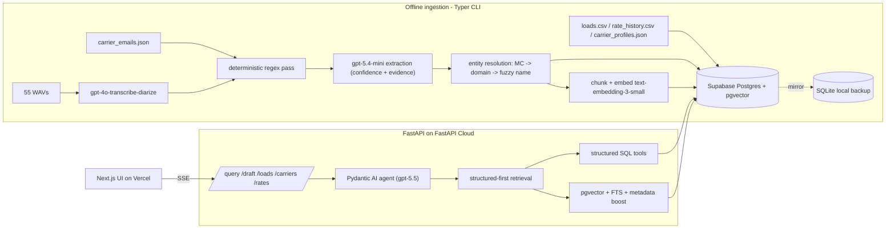

# Freight Carrier Agent

AI-native intake assistant for a freight broker's inbound queue. Ingests carrier
emails and call recordings, normalizes the messiness into a relational
system-of-record plus a vector evidence layer, and answers broker questions /
drafts carrier replies via a typed, tool-using agent.

Built phase by phase; each phase ends in a test gate.

## Stack

- **Datastore:** Supabase Postgres + `pgvector` (primary), SQLite (local backup/dev)
- **Agent:** Pydantic AI (`gpt-5.5`), native typed tools, structured-first hybrid retrieval
- **Ingestion:** deterministic parse + `gpt-5.4-mini` extraction; `gpt-4o-transcribe-diarize`; `text-embedding-3-small`
- **Backend:** FastAPI on FastAPI Cloud  ·  **Frontend:** Next.js + TS on Vercel
- **Eval:** Pydantic Evals on one core workflow

## Architecture



**Data model.** Canonical carrier/load/rate/offers stay **relational**; only
email bodies, transcript utterances, and notes are embedded. Tables: `carriers`,
`loads`, `rate_history`, `comm_events` (traceable evidence layer with
`extracted`/`confidence`/`raw_payload` jsonb), `offers` (extracted commercial
signal), `knowledge_chunks` (`vector(1536)` retrieval units). Uncertain
extractions live in jsonb without corrupting canonical records.

**Ingestion.** Deterministic parse → `gpt-5.4-mini` structured extraction (prefer
`null` over guessing) → entity resolution (MC → email domain → fuzzy name, with
cross-channel flagging) → chunk + embed. Calls are transcribed with a domain
glossary prompt, then run through the same extraction.

**Retrieval.** Structured-first policy enforced in code (load/MC/lane/date ⇒ call
the structured tool before semantic search); hybrid score
`0.55*vector + 0.25*fts + 0.20*metadata_boost`; a compliance gate surfaces
`authority_status` / `insurance_expiry` before suggesting a booking.

The **why** behind every choice and trade-off is in
[`docs/DECISIONS.md`](docs/DECISIONS.md). Extension-readiness: modular typed
tools, an extension-friendly jsonb schema, and idempotent/incremental ingestion.

## Getting started

Requires [uv](https://docs.astral.sh/uv/). From the repo root:

```bash
uv venv
uv sync --extra dev --extra ai --extra pg   # pg = Supabase/Postgres driver
cp .env.example .env                         # then set OPENAI_API_KEY
```

Load the relational core, then run the full ingestion pipeline:

```bash
uv run python -m freight_agent init-db
uv run python -m freight_agent load          # 50 loads / 48 carriers / 720 rates
uv run python -m freight_agent ingest all    # emails -> calls -> reconcile -> embed
uv run python -m freight_agent ask "Best rate on offer for load #29372289 vs market?"
uv run pytest
```

The full **run-and-verify guide** (setup, expected output, Supabase, tests,
troubleshooting) is in **[`runbooks/README.md`](runbooks/README.md)** — a single
document so it's easy to follow end to end.

## Evaluation

Core workflow: given one inbound carrier inquiry, identify carrier + load,
extract rate + availability, answer the broker question, and draft a reply.
Pydantic Evals over 12–15 goldens (email / call / cross-channel-messy), scoring
entity-resolution accuracy, offer-extraction F1, tool-selection correctness, and
answer/draft quality. _Scores + top failure modes + what I'd improve are recorded
here once the eval run lands (Phase 5)._

## Documentation

- **[`docs/DECISIONS.md`](docs/DECISIONS.md)** — ADR-style decision log (the
  "why" behind every choice and trade-off), written as the build progresses.
- **[`docs/AI_ARTIFACTS.md`](docs/AI_ARTIFACTS.md)** — how AI was used to build
  the project and how it powers the product (prompts, schemas, model tiers).

The run-and-verify guide lives in [`runbooks/README.md`](runbooks/README.md).

## Repo layout

- `freight_agent/` — package: `config`, `cli`, `rates`, `db/` (engine, models, schemas), `ingestion/`, `retrieval`, `tools`, `agent`
- `docs/` — `DECISIONS.md`, `AI_ARTIFACTS.md`
- `runbooks/` — single run/verify guide
- `tests/` — test gates
- `frontend/` — Next.js UI (added later)
- `data/` — local SQLite store + cached transcripts (gitignored)
