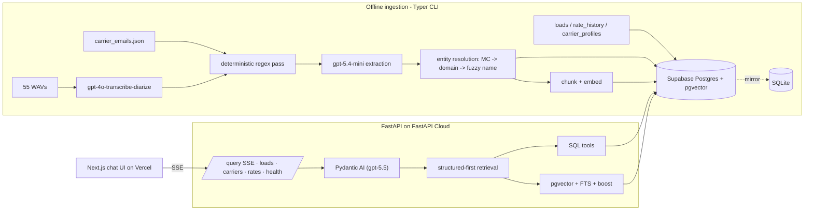

# Architecture

Rationale per choice lives in [`DECISIONS.md`](DECISIONS.md) (`Dn` tags below);
how AI was used is in [`AI_ARTIFACTS.md`](AI_ARTIFACTS.md).



## Data model

- **Relational canon:** `carriers` · `loads` · `rate_history` · `offers` — truth for structured answers.
- **Evidence layer:** `comm_events` — `extracted` / `confidence` / `raw_payload` jsonb; uncertain data never touches canon.
- **Vector layer:** `knowledge_chunks` `vector(1536)` — only bodies, utterances, notes embedded.
- **Single store, rows + vectors:** join by `load_id` / `carrier_id` / lane in one query; no separate vector DB (**D1**).
- **SQLite mirror:** same SQLAlchemy models, cross-dialect, for local dev/backup.

## Ingestion (offline Typer CLI)

- **Deterministic first:** regex extracts MC / `$rate` / refs / dates (`rate_quoted_usd` null on all 274 emails) (**D5**).
- **LLM extraction:** `gpt-5.4-mini`, strict schema, prefer `null` over guessing.
- **Transcription:** `gpt-4o-transcribe-diarize` + domain glossary (IDs, lanes, equipment, MCs) for garbled audio.
- **Entity resolution:** MC → email domain → fuzzy name; cross-channel carriers flagged.
- **Idempotent + FK-safe:** upsert by `load_id` / business key → re-runs converge, no orphaned `comm_events` (**D6**).
- **`--incremental`:** skip processed emails/WAVs, embed only new events (**D7**, **D16**).

## Retrieval

- **Structured-first:** id / lane / date → SQL tool before semantic search (**D15**).
- **Hybrid score:** `0.55·vector + 0.25·lexical + 0.20·metadata`, in-process over ~1.8k chunks, sub-ms (**D13**).
- **Compliance gate:** `authority_status` / `insurance_expiry` surfaced pre-booking.
- **Typed `AgentResponse`:** answer / records / confidence / follow_up / draft — blocks fabricated IDs (**D15**).

## Product surface

- **API:** FastAPI, read-only PG sessions; SSE `POST /query` (`status` → `tool` → `result`), `/query/sync` for eval; request-id + rate limit (**D19**).
- **UI:** Next.js 15 + TS, plain CSS, `ReadableStream` SSE reader — live tool chips, answer card, evidence cards, draft composer (**D20**).

## Evaluation

13 dataset-grounded goldens, per case then averaged:

- **Scores (0–1):** entity resolution · tool selection · fact coverage
- **Assertions:** no-fabrication · follow-up correctness · draft presence
- **LLM judges:** answer quality · draft factuality
- **Offline:** deterministic scorers unit-tested with no LLM (`tests/test_evals.py`) (**D22**).

## Repo layout

```
freight-carrier-agent/
├── freight_agent/             # BACKEND — Python package (deploy: FastAPI Cloud)
│   ├── api/                   #   FastAPI surface
│   │   ├── app.py             #     routes + SSE /query, /query/sync, lookups, /health
│   │   ├── deps.py            #     read-only engine, agent + embedder wiring
│   │   └── schemas.py         #     request/response models
│   ├── db/                    #   persistence (cross-dialect Postgres/SQLite)
│   │   ├── engine.py          #     engine, driver rewrite, timeouts, dual-write
│   │   ├── models.py          #     SQLAlchemy ORM (carriers/loads/comm_events/...)
│   │   └── schemas.py         #     Pydantic row schemas
│   ├── ingestion/             #   offline multi-modal pipeline
│   │   ├── parse_emails.py    #     deterministic email parse
│   │   ├── transcribe_calls.py#     WAV → diarized transcript
│   │   ├── extract.py         #     LLM structured extraction
│   │   ├── reconcile.py       #     entity resolution + cross-channel linking
│   │   ├── loaders.py         #     idempotent upsert loaders
│   │   ├── embed.py           #     chunk + embed
│   │   └── llm.py             #     model clients / embedder
│   ├── agent.py               #   Pydantic AI agent + typed AgentResponse
│   ├── tools.py               #   typed tools (load/carrier/rate/comms lookups)
│   ├── retrieval.py           #   structured-first hybrid search + scoring
│   ├── rates.py               #   market rate context helpers
│   ├── config.py              #   settings (models, DB, CORS, rate limit)
│   └── cli.py / __main__.py   #   `freight` Typer CLI (init-db, load, ingest, ask)
├── evals/                     # BACKEND — Pydantic Evals harness
│   ├── goldens.py             #   13 dataset-grounded cases
│   ├── scorers.py             #   deterministic scorers
│   ├── schema.py              #   Expected / EvalOutput types
│   ├── task.py                #   agent runner adapter
│   └── run.py                 #   CLI: scores table + JSON report
├── tests/                     # BACKEND — pytest gates (agent, api, ingestion, evals, data)
├── frontend/                  # FRONTEND — Next.js 15 + TS chat UI (deploy: Vercel)
│   ├── app/                   #   layout.tsx · page.tsx · globals.css
│   ├── components/            #   ResultView.tsx (answer + trace + draft)
│   └── lib/                   #   api.ts (SSE client) · types.ts
├── .github/workflows/ci.yml   # CI — ruff · mypy · pytest · frontend build (offline)
├── docs/                      # ARCHITECTURE · DECISIONS · AI_ARTIFACTS
├── runbooks/                  # end-to-end run/verify guide
├── data/                      # runtime SQLite + transcript cache (gitignored)
└── pyproject.toml · uv.lock   # uv-managed deps (extras: ai · pg · api · dev)
```

- Backend is the repo root — the importable package (`freight_agent.api.app:app`
  for the API, `freight` for the CLI).
- `frontend/` is the only non-Python subproject; `docs/` and `runbooks/`
  describe both apps, so they stay repo-wide (**D21**).
